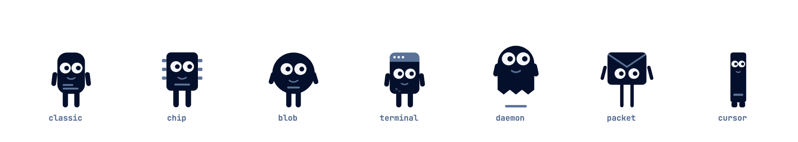
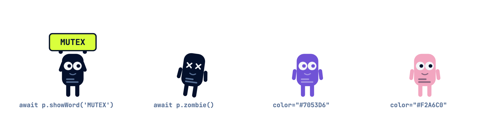

# daemonling

A tiny animated process character for your slides. `<daemonling-sprite>` is a zero-dependency web component that lives transparently on top of any `position:relative` container — it spawns with a pop, walks around, holds up code words on a sign, goes zombie, and terminates with a satisfying explosion.

Originally built to teach the process lifecycle (`new → ready → running → waiting → terminated`) in an operating systems lecture, but it works anywhere you want a small, expressive mascot: slides, docs, demos, error pages.

**[▶ Live demo](https://florianwenzel.github.io/daemonling/)**





- **Zero dependencies**, ~10 kB of runtime
- **7 variants**: `classic · chip · blob · terminal · daemon · packet · cursor`
- **Any body color** — accent colors are derived automatically
- **Promise-based API** — `await` each animation, chain them into choreographies
- **Shadow DOM** — no style leakage in either direction, `pointer-events: none` so it never blocks your page

## Install

```sh
npm install daemonling
```

```js
import 'daemonling'; // registers <daemonling-sprite>
```

Or via CDN, no build step:

```html
<script src="https://unpkg.com/daemonling"></script>
```

The bundle is also attached to every [GitHub release](https://github.com/FlorianWenzel/daemonling/releases/latest) as `index.global.js`.

<details>
<summary>Alternative: GitHub Package Registry</summary>

The same package is mirrored as `@florianwenzel/daemonling` on GitHub Packages. Point the scope there in your `.npmrc` (GitHub Packages requires a token with `read:packages` even for public installs):

```ini
@florianwenzel:registry=https://npm.pkg.github.com
//npm.pkg.github.com/:_authToken=${GITHUB_TOKEN}
```

```sh
npm install @florianwenzel/daemonling
```

</details>

## Use

```html
<div style="position: relative;"><!-- your slide / container -->
  <daemonling-sprite id="p" size="90" variant="classic" style="bottom: 110px;"></daemonling-sprite>
</div>
```

```js
const p = document.getElementById('p');

await p.spawn(300);          // pops up at x = 300 (px within the container)
await p.walkTo(1400);        // walks there, faces the direction of travel
await p.showWord('MUTEX');   // holds up the sign, keeps breathing
await p.hideWord();          // sign back down
await p.zombie();            // eyes turn to crosses, tilts over, wobbles
await p.terminate();         // shake → explosion → gone
p.despawn();                 // gone instantly, no explosion
```

All methods are `async` and resolve when the animation settles, so choreographies are plain `await` chains.

## Attributes

| Attribute | Default   | Description |
| --------- | --------- | ----------- |
| `variant` | `classic` | Figure design, one of `Daemonling.variants`: `classic`, `chip`, `blob`, `terminal`, `daemon`, `packet`, `cursor`. Switchable at runtime: `p.variant = 'daemon'`. |
| `color`   | `#04102B` | Body color, any CSS color. Detail/accent colors are derived automatically; the sign always stays dark. |
| `size`    | `90`      | Figure height in px. |
| `speed`   | `300`     | Walking speed in px/s at `size="90"` (scales with size). |

## API

| Member | Description |
| ------ | ----------- |
| `spawn(x?)` | Pop up at `x` (px within the container). |
| `walkTo(x)` | Walk to `x` with a bouncy gait, facing the direction of travel. |
| `showWord(word)` | Stop and hold up a sign (max 14 chars, uppercased). |
| `hideWord()` | Lower the sign. |
| `zombie()` | Eyes to crosses, tilts over, wobbles quietly. Finished, but not yet reaped. |
| `terminate()` | Panic → explosion into splinters → hidden. |
| `despawn()` | Hide immediately, no explosion. |
| `state` | Read-only: `'hidden' \| 'idle' \| 'walking' \| 'showing' \| 'zombie' \| 'exploding'`. |
| `x` | Read-only: current x position in px. |

## TypeScript

Types ship with the package, including the `HTMLElementTagNameMap` entry:

```ts
import { Daemonling } from 'daemonling';

const p = document.querySelector('daemonling-sprite'); // typed as Daemonling
```

## Demo

```sh
npm install
npm run build
open demo/index.html
```

## Notes

- The container needs `position: relative` (or any positioned ancestor); the sprite is `position: absolute` and anchored to the bottom edge. Offset it with inline `style="bottom: …"`.
- The legacy German variant names `klassiker` and `paket` still resolve (to `classic` and `packet`).
- The sign uses JetBrains Mono if it's loaded on the page, falling back to the system monospace stack.

## License

[MIT](LICENSE)
