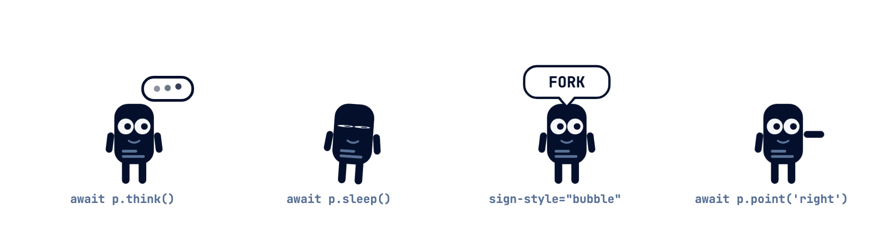

# daemonling

A tiny animated process character for your slides. `<daemonling-sprite>` is a zero-dependency web component that lives transparently on top of any `position:relative` container — it spawns with a pop, walks around, holds up code words on a sign, goes zombie, and terminates with a satisfying explosion.

Originally built to teach the process lifecycle (`new → ready → running → waiting → terminated`) in an operating systems lecture, but it works anywhere you want a small, expressive mascot: slides, docs, demos, error pages.

**[▶ Live demo](https://florianwenzel.github.io/daemonling/)** · **[▶ reveal.js demo](https://florianwenzel.github.io/daemonling/reveal.html)**




- **Zero dependencies**, ~10 kB of runtime
- **7 variants**: `classic · chip · blob · terminal · daemon · packet · cursor`
- **Any body color** — accent colors are derived automatically
- **Promise-based API** — `await` each animation, chain them into choreographies
- **Shadow DOM** — no style leakage in either direction, `pointer-events: none` so it never blocks your page

## Install

```sh
npm install daemonling
```

```js
import 'daemonling'; // registers <daemonling-sprite>
```

Or via CDN, no build step:

```html
<script src="https://unpkg.com/daemonling"></script>
```

The bundle is also attached to every [GitHub release](https://github.com/FlorianWenzel/daemonling/releases/latest) as `index.global.js`.

<details>
<summary>Alternative: GitHub Package Registry</summary>

The same package is mirrored as `@florianwenzel/daemonling` on GitHub Packages. Point the scope there in your `.npmrc` (GitHub Packages requires a token with `read:packages` even for public installs):

```ini
@florianwenzel:registry=https://npm.pkg.github.com
//npm.pkg.github.com/:_authToken=${GITHUB_TOKEN}
```

```sh
npm install @florianwenzel/daemonling
```

</details>

## Use

```html
<div style="position: relative;"><!-- your slide / container -->
  <daemonling-sprite id="p" size="90" variant="classic" style="bottom: 110px;"></daemonling-sprite>
</div>
```

```js
const p = document.getElementById('p');

await p.spawn(300);          // pops up at x = 300 (px within the container)
await p.walkTo(1400);        // walks there, faces the direction of travel
await p.showWord('MUTEX');   // holds up the sign, keeps breathing
await p.hideWord();          // sign back down
await p.wave();              // waves
await p.jump();              // hops with squash & stretch
await p.point('left');       // points in a direction
await p.think(1800);         // thought bubble with pulsing dots
await p.sleep();             // falls asleep, zZz
await p.wake();              // wakes up
await p.startle();           // startles (an interrupt!)
await p.freeze();            // freezes gray (SIGSTOP)
await p.unfreeze();          // thaws (SIGCONT)
await p.celebrate();         // cheers with confetti (exit 0)
const kid = await p.fork();  // duplicates itself, returns the clone
p.look('left');              // gaze direction, instant
await p.zombie();            // eyes turn to crosses, tilts over, wobbles
await p.terminate();         // shake → explosion → gone
p.despawn();                 // gone instantly, no explosion
```

All methods are `async` and resolve when the animation settles, so choreographies are plain `await` chains.

## Attributes

| Attribute | Default   | Description |
| --------- | --------- | ----------- |
| `variant` | `classic` | Figure design, one of `Daemonling.variants`: `classic`, `chip`, `blob`, `terminal`, `daemon`, `packet`, `cursor`. Switchable at runtime: `p.variant = 'daemon'`. |
| `color`   | `#04102B` | Body color, any CSS color. Detail/accent colors are derived automatically; the sign always stays dark. |
| `size`    | `90`      | Figure height in px. |
| `speed`   | `300`     | Walking speed in px/s at `size="90"` (scales with size). |
| `sign-style` | `sign` | `sign` or `bubble` (speech bubble; arms stay down). |
| `sign-color` | `#D9FF3C` | Sign background (`#FFFFFF` for bubbles). |
| `sign-text-color` | `#04102B` | Sign text color. |
| `sign-border-color` | `#04102B` | Sign border color. |

## API

| Member | Description |
| ------ | ----------- |
| `spawn(x?)` | Pop up at `x` (px within the container). |
| `walkTo(x, {speed}?)` | Walk to `x` with a bouncy gait, facing the direction of travel. Optional per-walk speed (px/s). |
| `showWord(word)` | Stop and hold up the sign (max 14 chars, uppercased). |
| `hideWord()` | Lower the sign. |
| `wave()` | Wave with the right arm (armless variants tilt-wave). |
| `jump()` | Hop once, with squash & stretch. |
| `point(dir, ms?)` | Point `'left'` or `'right'` for `ms` (default 1400). |
| `think(ms?)` | Thought bubble with pulsing dots for `ms` (default 1800). |
| `sleep()` / `wake()` | Fall asleep (zZz, blocks everything) / wake up. |
| `startle()` | Brief shock — an interrupt. Doesn't end sleep; use `wake()`. |
| `freeze()` / `unfreeze()` | Freeze gray in the current pose (SIGSTOP) / thaw (SIGCONT). |
| `celebrate()` | Cheer with confetti (exit 0). |
| `fork()` | Duplicate; resolves with the clone element (also a full `Daemonling`). |
| `look(dir)` | Gaze `'left' \| 'right' \| 'up' \| 'down' \| 'center'`, instant. |
| `zombie()` | Eyes to crosses, tilts over, wobbles quietly. Finished, but not yet reaped. |
| `terminate()` | Panic → explosion into splinters → hidden. |
| `despawn()` | Hide immediately, no explosion. |
| `state` | Read-only: `'hidden' \| 'idle' \| 'walking' \| 'showing' \| 'waving' \| 'jumping' \| 'pointing' \| 'thinking' \| 'sleeping' \| 'startled' \| 'frozen' \| 'cheering' \| 'zombie' \| 'exploding'`. |
| `x` | Read-only: current x position in px. |

## reveal.js plugin

The optional `daemonling/reveal` subpath ships a [reveal.js](https://revealjs.com) plugin. It puts one persistent sprite into the deck's `.slides` element (so it scales with the presentation) and drives it declaratively from `data-dl` attributes:

```js
import RevealDaemonling from 'daemonling/reveal';

Reveal.initialize({
  plugins: [RevealDaemonling({ size: 70, variant: 'classic', bottom: '10px' })],
});
```

Or without a build step (`<script src=".../dist/reveal.global.js">` defines `window.RevealDaemonling`).

```html
<section data-dl="spawn 200; walk 700; word MUTEX">…</section>
<section data-dl-keep>sprite stays put here</section>
<section>
  <p class="fragment" data-dl="celebrate" data-dl-undo="startle">…</p>
</section>
```

Commands are separated by `;`, arguments by spaces: `spawn [x]` · `walk x [speed]` · `word TEXT` · `hide` · `wave` · `jump` · `point left|right [ms]` · `think [ms]` · `sleep` · `wake` · `startle` · `freeze` · `unfreeze` · `celebrate` · `fork` · `look dir` · `zombie` · `terminate` · `despawn` · `wait ms` · `variant name` · `color value`. X coordinates use reveal's slide coordinate system (960×700 by default).

Changing slides cancels the running script; slides without `data-dl` despawn the sprite unless they have `data-dl-keep` (or the plugin gets `autoDespawn: false`). Fragments run their `data-dl` when shown and `data-dl-undo` when hidden again. Options: `size`, `variant`, `color`, `speed`, `signStyle`, `bottom`, `zIndex`, `attribute` (rename `data-dl`), `autoDespawn`. The plugin object exposes `sprite` and `run(script)` for imperative control.

## TypeScript

Types ship with the package, including the `HTMLElementTagNameMap` entry:

```ts
import { Daemonling } from 'daemonling';

const p = document.querySelector('daemonling-sprite'); // typed as Daemonling
```

## Demo

```sh
npm install
npm run build
open demo/index.html
```

## Notes

- The container needs `position: relative` (or any positioned ancestor); the sprite is `position: absolute` and anchored to the bottom edge. Offset it with inline `style="bottom: …"`.
- The legacy German variant names `klassiker` and `paket` still resolve (to `classic` and `packet`), as do the German direction words (`links`/`rechts`/`oben`/`unten`/`mitte`) and `sign-style="blase"`.
- The sign uses JetBrains Mono if it's loaded on the page, falling back to the system monospace stack.

## License

[MIT](LICENSE)
